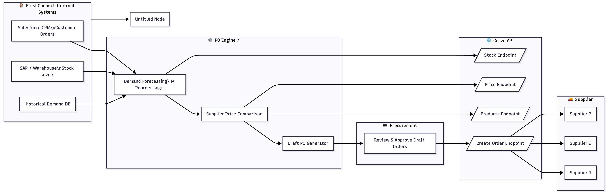

# FreshConnect x Cerve — Automated Purchase Order Integration  

Connecting FreshConnect’s internal systems through the Cerve API to automate purchase orders.
A Developer Experience showcase built to demonstrate how to guide a small team through real-world API integration — from architecture to code to storytelling.

## 🚀 The Mission

FreshConnect Foods — a £45M Birmingham-based food distributor — was drowning in manual procurement:

- 15+ hours/week spent on repetitive admin
- Frequent stockouts and rush orders
- No consistent price comparison across 20+ suppliers

They needed a smarter, automated way to generate purchase orders — and the Cerve API became the bridge between their fragmented systems and supplier networks.

This project shows how that connection could be designed, implemented, and taught to developers in a clear, scalable way.

---


## 🎯 Objectives

| Goal | Target Outcome |
|------|----------------|
| Reduce admin workload | 15h → 3h per week |
| Reduce stockouts | -60% |
| Cut emergency orders | -75% |
| Save on purchasing | 5–8% through better price comparison |

---


## 🏗️ System Architecture
A single, connected flow — from customer demand to supplier order.

> See the live diagram in [docs/architecture.md](./docs/architecture.md)

## ⚙️ How It Works
| Step | What Happens | Cerve Role |
|:----:|---------------|------------|
| 1️⃣ **Sync Data** | Pull stock from SAP & orders from Salesforce | — |
| 2️⃣ **Forecast** | Predict reorders using historical demand | — |
| 3️⃣ **Compare** | Query Cerve for product prices & stock | `GET /products`, `GET /price`, `GET /stock` |
| 4️⃣ **Generate** | Build draft POs automatically | `POST /orders?draft=true` |
| 5️⃣ **Approve** | Procurement reviews and confirms | — |
| 6️⃣ **Submit** | Send approved POs to suppliers | `POST /orders` |

💡 *From 60 minutes per order → 8 minutes.*

## 🧰 Project Structure
```
cerve-po-automation/
├── code/
│   ├── python/
│   │   ├── cerve_po_integration.py      # Main demo script
│   │   └── requirements.txt
│   └── samples/
│       └── sample_env.example           # Example environment config
├── docs/
│   ├── architecture.md
│   ├── api-flow.md
│   ├── architecture.png
│   └── samples/
│       └── draft_order_example.json     # Fake demo draft order
├── .github/workflows/ci.yml             # Lightweight CI workflow
└── README.md
```

## 💻 Run the Demo
### 1. Setup environment
```
python3 -m venv .venv
source .venv/bin/activate
pip install -r code/python/requirements.txt
```
### 2. Configure credentials
```
cp code/samples/sample_env.example .env
# Edit with your own keys or leave placeholders
```
### 3. Run integration (draft mode only)
```
python code/python/cerve_po_integration.py
```
> 🧠 The script simulates:
> - Authentication with Cerve (OAuth2)
> - Price lookup
> - Draft PO creation
>   
> ➡️ Results are saved to docs/samples/draft_order_example.json


## 📘 Example Output
```
{
  "_note": "⚠️ Fabricated example for demonstration purposes only.",
  "supplier_order_id": "FC-DEMO-0001",
  "status": "draft",
  "total": 218.50,
  "currency": "GBP",
  "line_items": [
    {"supplier_product_id": "APLJ-1L", "quantity": 10, "unit_price": 20.0},
    {"supplier_product_id": "BAN-2KG", "quantity": 5, "unit_price": 3.7}
  ]
}
```

## 🔗 API Endpoints Used
## 🔗 API Endpoints Used  

| Purpose | Method | Endpoint |
|----------|--------|----------|
| **Auth** | `POST` | `/v2/token` |
| **Products** | `GET` | `/suppliers/{supplier_id}/customers/{customer_id}/products` |
| **Price** | `GET` | `/suppliers/{supplier_id}/customers/{customer_id}/products/{product_id}/price` |
| **Draft Order** | `POST` | `/suppliers/{supplier_id}/customers/{customer_id}/orders?draft=true` |
| **Submit Order** | `POST` | `/suppliers/{supplier_id}/customers/{customer_id}/orders` |

📄 *Full reference available in* [`docs/api-flow.md`](docs/api-flow.md)


