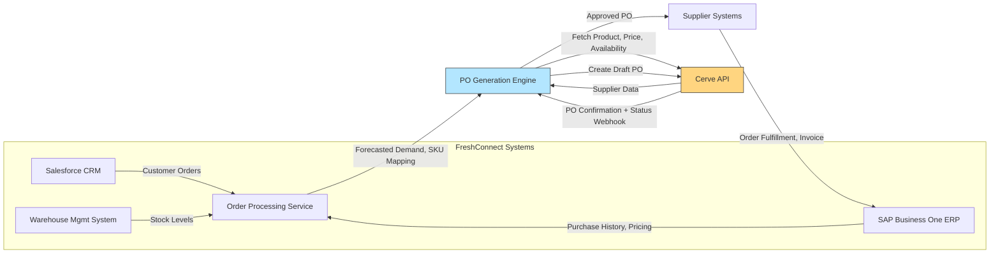

# cerve-po-automation

# Automated Purchase Order Generation using Cerve API

## 1️⃣ Solution Architecture Diagram

> **Figure 1:** End-to-end data flow from FreshConnect systems through Cerve API to suppliers.

## 2️⃣ Cerve API Implementation Plan

- **Goal:** Automatically generate, compare, and send POs.

- **Endpoints:** `/products`, `/suppliers`, `/purchase-orders`

- **Flow:**

  - Get forecast & stock data.
  - Query suppliers via Cerve API.
  - Generate draft PO.
  -Send PO for approval → Cerve → Supplier.

- **Auth:** OAuth 2.0 client credentials.
- **Error Handling:** Retry 3x on 5xx, log 4xx, notify Slack.
- **Sync:** Batch every 15 min; Webhook for PO updates.

## 3️⃣ Developer Quick Start Guide

**Audience:** FreshConnect backend devs (Python/PostgreSQL)

**Prerequisites: **

- Python 3.10+

- .env with:
```
CERVE_CLIENT_ID=xxxx
CERVE_CLIENT_SECRET=xxxx
```
Steps: 

1. Clone repo.

2. Install dependencies: `pip install -r requirements.txt`

3. Run: `python code/cerve_po_integration.py`

## 4️⃣ Working Code Example

See code/cerve_po_integration.py
 for a full example.

## 5️⃣ Success Metrics

⏱ Reduce PO creation from 60→12 mins

💸 Save 5–8% through price comparison

📉 Cut emergency orders by 75%

## 6️⃣ Contributors

You: Developer Relations Candidate

For: Cerve API Assessment 2025
