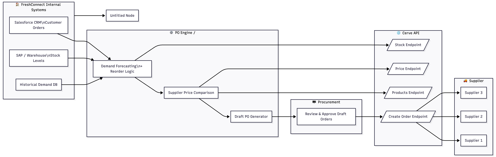

# 🥦 FreshConnect x Cerve — Automated Purchase Order Integration  

**Author:** Amy Waliszewska — Developer Relations (assignment demo)  
**Use case:** Automated Purchase Order Generation using the Cerve API 

---

## 🌍 Context

FreshConnect Foods is a mid-sized food service distributor struggling with manual procurement — 15+ hours/week spent creating purchase orders across 20+ suppliers.  
The goal of this integration is to **automate PO suggestions and submissions** using the **Cerve API**, reducing admin time, improving stock accuracy, and optimizing supplier pricing.

---


## 🎯 Objectives

| Goal | Target Outcome |
|------|----------------|
| Reduce admin workload | 15h → 3h per week |
| Reduce stockouts | -60% |
| Cut emergency orders | -75% |
| Save on purchasing | 5–8% through better price comparison |

---


## 🏗️ System Architecture



### Components
- **Salesforce CRM:** source of upcoming customer orders  
- **SAP / Warehouse System:** live stock data  
- **Inventory Service:** merges order + stock data into a unified model  
- **PO Engine (Orchestrator):** forecasts demand, compares supplier prices, generates draft POs  
- **Procurement UI:** human approval and adjustments  
- **Cerve API:** supplier integration layer (pricing, stock, and order submission)

Data flows both ways — from FreshConnect’s internal systems → through the PO Engine → to suppliers via Cerve.

---

## ⚙️ Cerve API Integration Overview

| Step | Endpoint | Purpose |
|------|-----------|----------|
| 1 | `GET /suppliers/{supplier_id}/customers/{customer_id}/products` | Retrieve available products |
| 2 | `GET /suppliers/{supplier_id}/customers/{customer_id}/products/{product_id}/price?quantity=` | Fetch unit & total price for each supplier |
| 3 | `GET /suppliers/{supplier_id}/customers/{customer_id}/products/{product_id}/stock` | Check availability |
| 4 | `POST /suppliers/{supplier_id}/customers/{customer_id}/orders?draft=true` | Generate draft PO for procurement review |
| 5 | `POST /suppliers/{supplier_id}/customers/{customer_id}/orders` | Submit approved PO |

**Authentication:** OAuth2 Client Credentials (token via `https://auth.cerve.com/v2/token`)  
**Data sync model:** event-driven (new orders from Salesforce) + periodic polling (stock/price refresh)

---

## 🧩 Implementation Notes

- **Language:** Python (clean, simple for backend team)  
- **Auth:** token cached in memory; refreshed automatically before expiry  
- **Error handling:** graceful retries with exponential backoff; differentiates between transient (timeout, 5xx) and permanent (400/404/409) errors  
- **Data caching:** product list cached daily; stock polled selectively for hot SKUs  
- **Extensibility:** modular enough to plug into other CRMs or forecasting models  

---

## 🧑‍💻 Developer Quick Start

1. **Clone repo**
   ```
   git clone https://github.com/hakierka/cerve-po-automation.git
   cd cerve-po-automation
   ```

2. **Set up environment**
   ```
   cp code/samples/sample_env.example .env
   ```

Fill in your credentials from Cerve’s developer portal.

3. **Install dependencies**
   ```
   python -m venv .venv
   source .venv/bin/activate
   pip install -r code/python/requirements.txt
   ```


4. **Run demo**
   ```
   python code/python/cerve_po_example.py
   ```


> ✅ The script will:
> - Authenticate with Cerve
> - Fetch sample product price
> - Generate a draft order (draft=true)
> - Save response JSON in docs/samples/draft_order_example.json

## 🧾 Example Output
   ```
   {
     "supplier_order_id": "FC-DEMO-1730769600",
     "total": 218.50,
     "currency": "GBP",
     "line_items": [
       {
         "supplier_product_id": "APLJ-1L",
         "quantity": 10,
         "unit_price": 20.00,
         "total_price": 200.00
       }
     ],
     "status": "draft",
     "unavailable_line_items": []
   }
   ```


