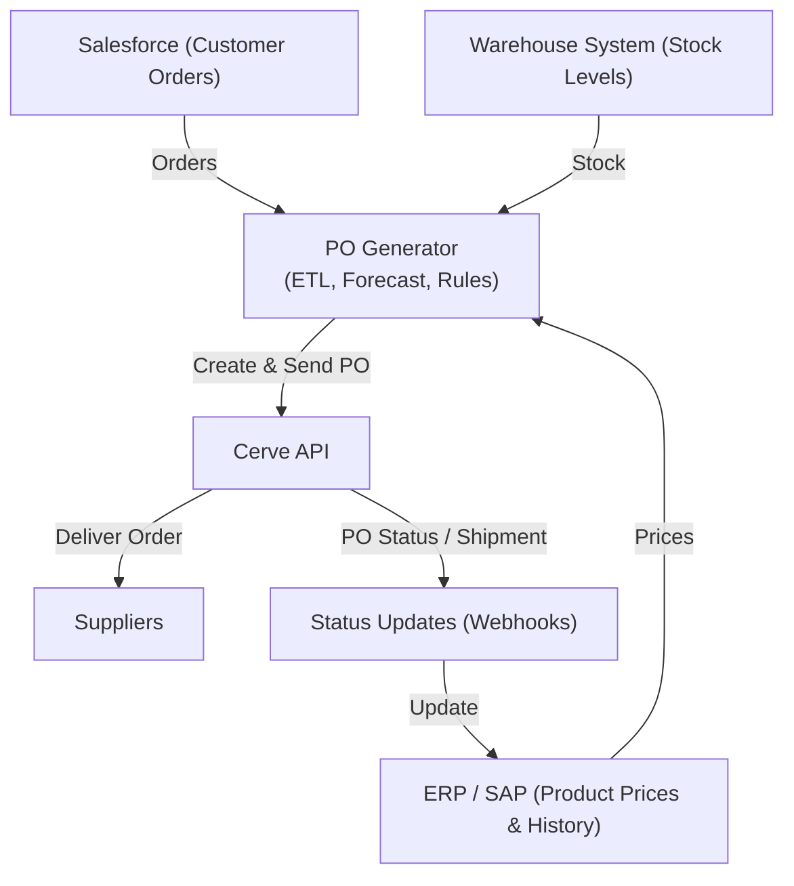

# 🧩 Automated Purchase Order Generation — Cerve API Integration

> A proof-of-concept integration for **FreshConnect Foods**, demonstrating automated Purchase Order generation using the **Cerve API**.  
> Built for the **Cerve Developer Experience Assessment (Nov 2025)**.

Company: FreshConnect Foods

Use Case: Automated Purchase Order Generation

Candidate: Amy Waliszewska

Date: November 2025

## 1️⃣ Solution Architecture Diagram

> **Figure 1:** Automated Purchase Order Generation via Cerve API — showing data flow between FreshConnect systems, Cerve, and suppliers.

## 2️⃣ Cerve API Implementation Plan

### Objective
Automate and streamline purchase order generation by connecting FreshConnect’s internal systems (Salesforce, WMS, SAP) with suppliers via the Cerve API.

### **Key Endpoints**

| Goal | Endpoint | Purpose |
|------|-----------|----------|
| Authentication | `POST /oauth/token` | Get OAuth2 access token |
| Product Lookup | `GET /v1/products?sku={sku}` | Map internal SKU to Cerve product ID |
| Supplier Pricing | `GET /v1/products/{id}/pricing` | Compare supplier costs |
| Availability | `GET /v1/products/{id}/availability` | Confirm supplier stock |
| Create Purchase Order | `POST /v1/purchase-orders` | Create draft or final PO |
| PO Tracking | `GET /v1/purchase-orders/{id}` / Webhook | Track PO and shipment status |

**Auth**

- `POST /oauth/token` — OAuth2 client credentials → get access token (expires short).

**Product & catalog**

- `GET /v1/products?sku={sku}` — map internal SKU to Cerve product id / metadata.

- `GET /v1/products` (filters/paging) — list products for supplier matching.

**Pricing & availability**

- `GET /v1/products/{product_id}/pricing` — supplier prices, pack sizes, lead times.

- `GET /v1/products/{product_id}/availability` — stock / available qty per supplier.

**Purchase orders**

- `POST /v1/purchase-orders` — create draft/submit PO. Use Idempotency-Key header.

- `GET /v1/purchase-orders/{id}` — fetch PO status.

**Webhooks**

- `POST /webhooks` (Cerve registers callback) — receive po.status, shipment.* events.

### Request/Response Flow

1. Auth: Obtain token with Client ID & Secret.

2. Data Prep: Merge data from Salesforce (orders), WMS (inventory), and SAP (purchase history).

3. Lookup & Price Check: Query Cerve for supplier prices and stock per SKU.

4. Generate Draft PO: Create draft PO grouped by supplier.

5. Approval: Procurement approves/rejects draft.

6. Submit: Send approved PO via Cerve.

7. Track: Cerve webhook updates PO status back into ERP.

### Authentication & Authorization

- OAuth2 Client Credentials flow (short-lived tokens).

- Store credentials securely in .env or AWS Secrets Manager.

- Refresh token before expiry.


### **Error Handling Strategy**

| Error Type | Handling Approach |
|-------------|-------------------|
| **5xx / Network Timeout** | Retry up to 3 times with exponential backoff (1s → 2s → 4s). Log error and continue. |
| **401 / 403 Unauthorized** | Refresh OAuth token and retry the request. Raise alert if repeated. |
| **409 Conflict** | Use idempotency key to prevent duplicate PO creation. Handle conflict gracefully. |
| **422 Validation Error** | Log full payload and API response. Notify procurement for data correction. |
| **Webhook Delivery Failure** | Retry webhook delivery 5x with delay. Queue failed payloads for manual retry. |
| **Supplier Unavailable** | Fallback to secondary supplier or schedule retry after delay. |

### **Data Synchronization Approach**

| Data Type | Frequency | Method | Notes |
|------------|------------|--------|-------|
| Stock & Orders | Hourly | Poll internal APIs | Used for demand forecasting and par-level checks. |
| Supplier Prices | Every 15 minutes | Cerve API (`GET /products/pricing`) | Cache for 15 minutes to avoid rate limits. |
| Purchase Order Status | Real-time | Webhooks from Cerve (`/po.status`) | Update internal dashboard immediately. |
| ERP / SAP Sync | Nightly | Batch export/import | For reconciliation and cost reporting. |
| Supplier Catalog Updates | Weekly | Scheduled job via Cerve API | Refresh product metadata and units. |

## 3️⃣ Developer Quick Start Guide
### 🧰 Prerequisites

- Python 3.10+

- `requests` and `python-dotenv` installed

- Cerve Sandbox credentials (Client ID + Secret)

- Access to internal Salesforce/WMS/SAP test data

### ⚙️ Environment Setup

1. Copy the example environment file:
```
cp .env.example .env
```
2. Edit `.env` with your credentials:
```
CERVE_BASE_URL=https://api.sandbox.cerve.com
CERVE_CLIENT_ID=your_client_id
CERVE_CLIENT_SECRET=your_secret
```
3. Install dependencies:
```
pip install -r requirements.txt
```
4. Test the integration:
```
python code/cerve_po_integration.py
```
> 🧩 Notes:
> - Never commit .env files — keep secrets private.
> - Use sandbox credentials only for testing.
> - Production base URL: https://api.cerve.com.
> - Store credentials in AWS Secrets Manager or Vault for production.
> - Log all API calls for audit purposes.

## 4️⃣ Working Code Example (Python)

File: `code/cerve_po_integration.py`
```
import os
import requests
from dotenv import load_dotenv

load_dotenv()

CERVE_BASE_URL = os.getenv("CERVE_BASE_URL", "https://api.sandbox.cerve.com")
CERVE_AUTH_URL = f"{CERVE_BASE_URL.replace('api.', 'auth.')}/oauth/token"
CLIENT_ID = os.getenv("CERVE_CLIENT_ID")
CLIENT_SECRET = os.getenv("CERVE_CLIENT_SECRET")

def get_access_token() -> str:
    """Authenticate via OAuth2 and return bearer token."""
    res = requests.post(
        CERVE_AUTH_URL,
        data={
            "grant_type": "client_credentials",
            "client_id": CLIENT_ID,
            "client_secret": CLIENT_SECRET,
        },
        timeout=10,
    )
    res.raise_for_status()
    return res.json().get("access_token")

def get_products(access_token: str, category: str = "fresh-produce") -> list:
    """Fetch available products from Cerve API."""
    headers = {"Authorization": f"Bearer {access_token}"}
    res = requests.get(f"{CERVE_BASE_URL}/v1/products", headers=headers, params={"category": category}, timeout=10)
    res.raise_for_status()
    return res.json().get("data", [])

def create_purchase_order(access_token: str, items: list) -> dict:
    """Create a draft Purchase Order in Cerve."""
    headers = {"Authorization": f"Bearer {access_token}", "Content-Type": "application/json"}
    payload = {
        "supplier_id": "SUP1234",
        "status": "draft",
        "currency": "GBP",
        "items": items,
        "notes": "Auto-generated PO from FreshConnect integration demo",
    }
    res = requests.post(f"{CERVE_BASE_URL}/v1/purchase-orders", headers=headers, json=payload, timeout=10)
    res.raise_for_status()
    return res.json()

def main():
    print("🚀 Starting Cerve Automated PO Example...")
    token = get_access_token()
    print("✅ Authenticated with Cerve API.")

    products = get_products(token)
    if not products:
        print("❌ No products found — aborting.")
        return

    po_items = [
        {
            "product_id": products[0]["id"],
            "quantity": 100,
            "unit_price": products[0]["price"],
        }
    ]
    po = create_purchase_order(token, po_items)
    print("✅ Draft PO Created:")
    print(po)

if __name__ == "__main__":
    main()
```
## 5️⃣ Success Metrics
### **Success Metrics**

| KPI / Metric | Current State | Target State | Improvement / Impact |
|---------------|----------------|----------------|----------------------|
| **Procurement Admin Time** | ~15 hrs per week | ≤ 3 hrs per week | ↓ **80%** reduction in manual workload |
| **Stockouts (Missed Orders)** | Frequent (2–3 per week) | Rare (≤1 per month) | ↓ **60%** fewer stockouts |
| **Emergency Orders** | 15–20% higher cost | <5% of orders | ↓ **75%** reduction in urgent/rush orders |
| **Purchase Cost Efficiency** | No price comparison | Optimized supplier selection | **5–8%** average cost savings |
| **PO Creation Time (per supplier)** | 45–60 minutes | 8–10 minutes | ↓ **85%** faster process |
| **Quote-to-Order Accuracy** | 70% | 95% | ↑ **25%** accuracy improvement |

## 6️⃣ Future Enhancements

- Add ML-based demand forecasting for more accurate reorder quantities.
- Build React dashboard for procurement approval workflow.
- Add Slack notifications for PO status changes via Cerve webhooks.
- Integrate shipment tracking into ERP through Cerve’s tracking endpoints.
